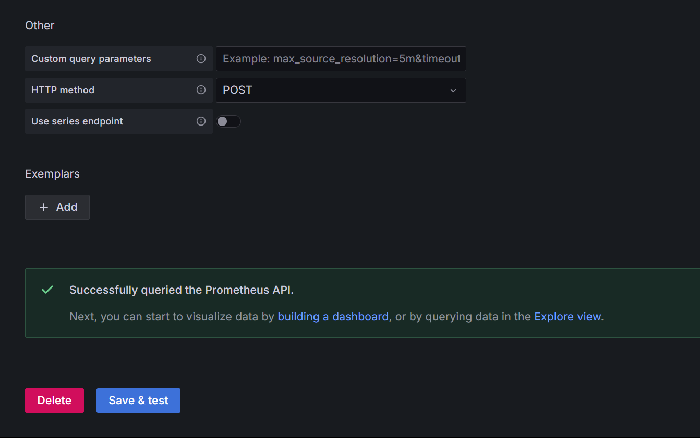

## Grafana - Setup for visualization

Grafana OSS - Visualize your data, optimize your performance.

Easily collect, correlate, and visualize data with beautiful dashboards using Grafana — the open source data visualization and monitoring solution that drives informed decisions, enhances system performance, and streamlines troubleshooting.

The easiest way to get started with the latest version of Grafana is with Grafana Cloud, our fully managed observability stack. [Grafana](https://grafana.com/grafana/download?edition=oss)

```
./install-grafana.sh
```

Note:- Accessing the Grafana - [localhost:3000](http://localhost:3000)

----

#### Connecting Grafana to Prometheus
Navigate to [Grafana](http://localhsot:3000)

Add the data-source connection as below:


Check the connectivity:


----
Next: [Create dashboard](docs/04-dashboard-readme.md)
Previous: [Node-Exporter](docs/02-node-exporter-readme.md)