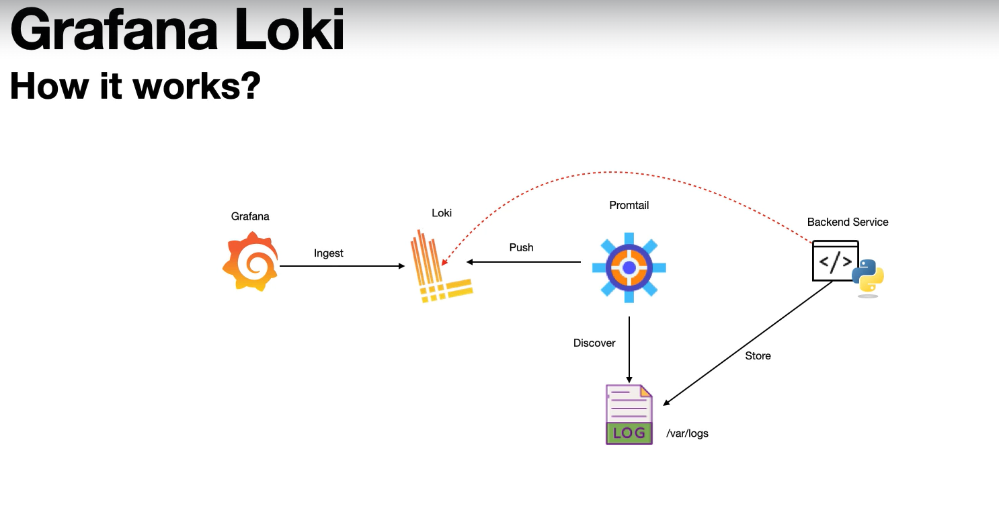

## Grafana Loki

Loki is an open-source log aggregation system designed to work seamlessly with grafana
* Log Aggregation: Collecting, storing, and quering large amount of logs.
* Prometheus-inspired design: Uses similar concepts same as PromQL.
* Integration with Grafana: Users can visualize log data in dashboards, also for other observability metrics.
* Distributed Architecture: It can scale horizontally and cost-effective.

How it works: [loki](https://grafana.com/docs/loki/latest/setup/install/)
